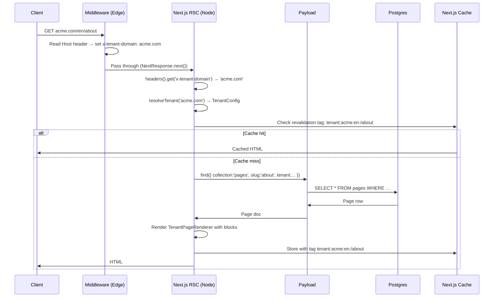

# Architecture

## Request flow (production)



## Request flow (dev preview)

```
GET localhost:3000/tenant/__fixture__.test/en/about
    ↓ Middleware (Edge)
      - Detects /tenant/ prefix
      - Extracts domain: __fixture__.test
      - Rewrites URL to: /en/about
      - Sets header: x-tenant-domain: __fixture__.test
    ↓ RSC page.tsx (same as production from here)
      - resolveTenant('__fixture__.test') → fixture TenantConfig
      - Queries Payload for the page
      - Renders
```

## Tenant resolution

```
Host header (or /tenant/<domain> path)
    ↓
src/tenants/registry.ts
  - Static import of all TenantConfig files
  - Builds Map<domain, TenantConfig> at module load
    ↓
resolveTenant(host: string): TenantConfig | null
  - Normalises: lowercase, strip www., strip port
  - Lookup in Map
    ↓
TenantConfig | null
  - null → notFound() or NoTenantsPage
  - TenantConfig → render with tenant context
```

## Content flow (CMS → DB → SSG → revalidation)

```
Admin edits page in Payload
    ↓
Payload saves to PostgreSQL
    ↓
Collection afterChange hook fires
    ↓
buildRevalidationTags(tenantSlug, locales, [slug])
    ↓
revalidateTag('tenant:acme:en:/about')
    ↓
Next.js invalidates cached RSC response
    ↓
Next request for /en/about → cache miss → re-render from DB
    ↓
New HTML cached with same tags
```

## Multi-tenant data model

```
tenants            users               pages
---------          -----               -----
id                 id                  id
name               email               title (localized)
slug               roles[]             slug
domains[]          (tenant scoping     layout[] (blocks, localized)
active             via plugin)         meta (localized)
                                       tenant → tenants
                                       _status (draft|published)
```

## Revalidation tags hierarchy

```
tenant:acme                      ← flush all acme pages
  tenant:acme:en                 ← flush all English pages
    tenant:acme:en:/about        ← flush one page
  tenant:acme:de
    tenant:acme:de:/about
```
